<p align="center">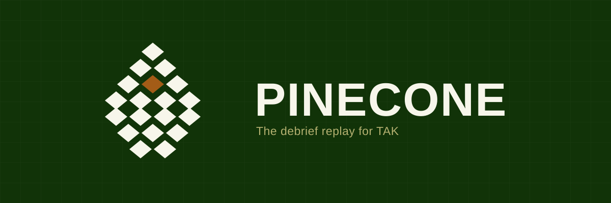</p>

# Pinecone user guide

This guide starts the moment Pinecone is installed on your TAK Server box and takes you through
a debrief: reaching the hour it happened, reading the map, marking the moments that matter,
settling a fact from the record, and leaving the room with a file. The pictures are of a
synthetic exercise; yours will show your own callsigns.

Pinecone records every position report and every GeoChat message your TAK Server routes, keeps
its own copy on the box, and plays any window of it back in a browser. It never guesses what
happened between two reports, it never says why anything happened, and it never grades anyone.
Those are design rules, not gaps.

## 1. Open the replay

Pinecone is a web page served by the box it is installed on. Open a browser on any laptop that
can reach the box and go to its address on port 8765, for example `http://192.0.2.10:8765/`.
The replay opens straight away; the box's own report, what it found on the server and what it
holds, is at `/status`.

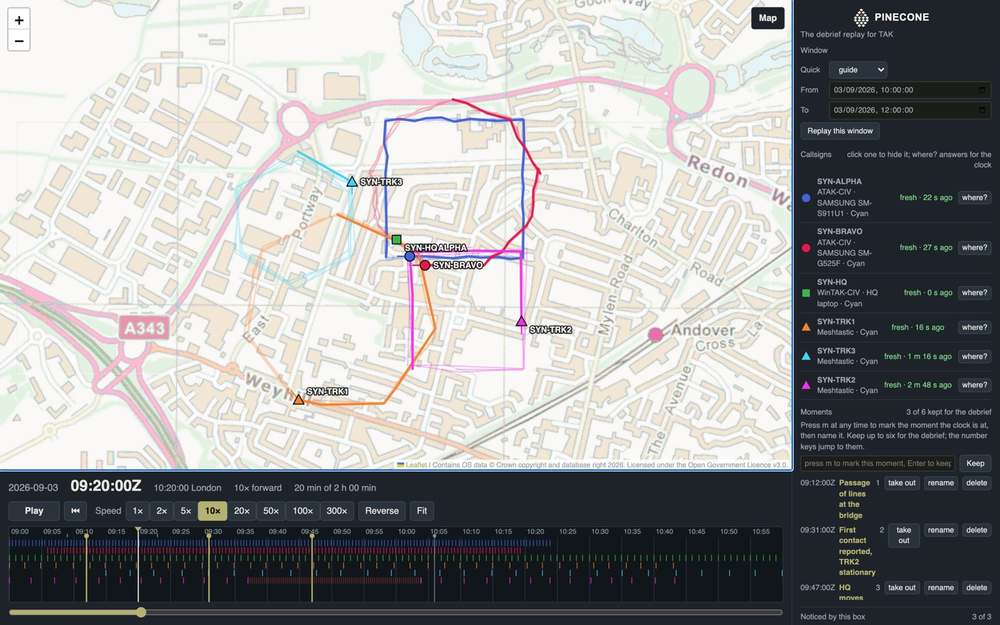

The screen has three parts. The **map** fills the left. The **timeline** sits underneath it, one
row per callsign, with the clock and the transport controls. The **side panel** on the right runs
in the order a debrief does: the window, the callsigns, the moments, the messages, the ground and
the record.

## 2. Reach the hour it happened

The Window panel is the first thing in the side panel. The quick list offers the last hour, the
last six hours and the last day of what the box holds; From and To take any period you name.
Press **Replay this window**.

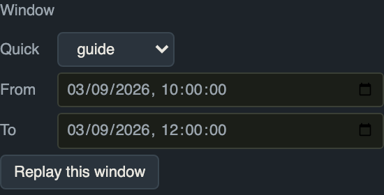

The line under the fields says how much the box holds and from when, so you know what you can
reach. A window is part of the page's address, so a replay can be sent to somebody else on the
same box as a link.

## 3. Read the map and the callsigns

Each callsign is a marker with a trail behind it. The marker sits at the last report received at
or before the clock; nothing is drawn between reports. A **hollow** marker has had no report for
longer than that callsign's own threshold, four times its usual interval, and a trail **breaks**
where reports stopped. That is deliberate: a gap in the comms is shown as a gap, never as a
callsign standing still.

The Callsigns panel lists everyone in the window with what they are on. Click a row to hide that
callsign from the map, and again to show it.

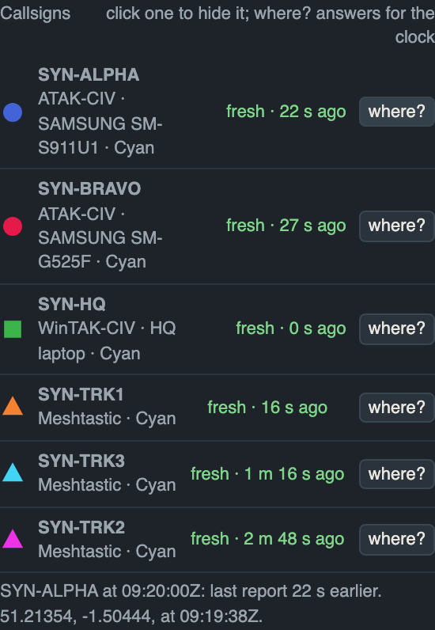

Press **where?** beside a callsign and the panel answers for the clock's time: how old the last
report was, where it was, and the word *stale* when the report is older than that callsign's
threshold. The map pans to the spot. If one handset appears as two nodes with one callsign, the
answer says so and uses the newest report across them.

## 4. Play, pause, move through time

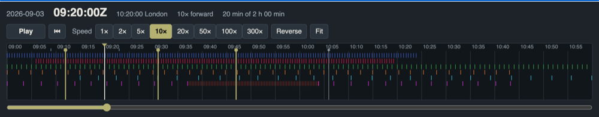

Press **Play**, or the space bar. The speed buttons run from real time to 300 times; **Reverse**
plays backwards; **Fit** brings every track into view. The arrow keys step ten seconds. Click or
drag on the timeline to jump. Along the top rule of the timeline sit the messages, as small
ticks; the moments you keep are drawn on it too; a callsign's dropouts are hatched on its row.

The clock shows UTC and London time together, because the record is kept in the server's time
and the room thinks in local.

## 5. The map underneath

Nothing is chosen for you. When the laptop has a network, the replay opens on OpenStreetMap and
the Map button says so. When it does not, the map is blank and asks you to pick a map pack.

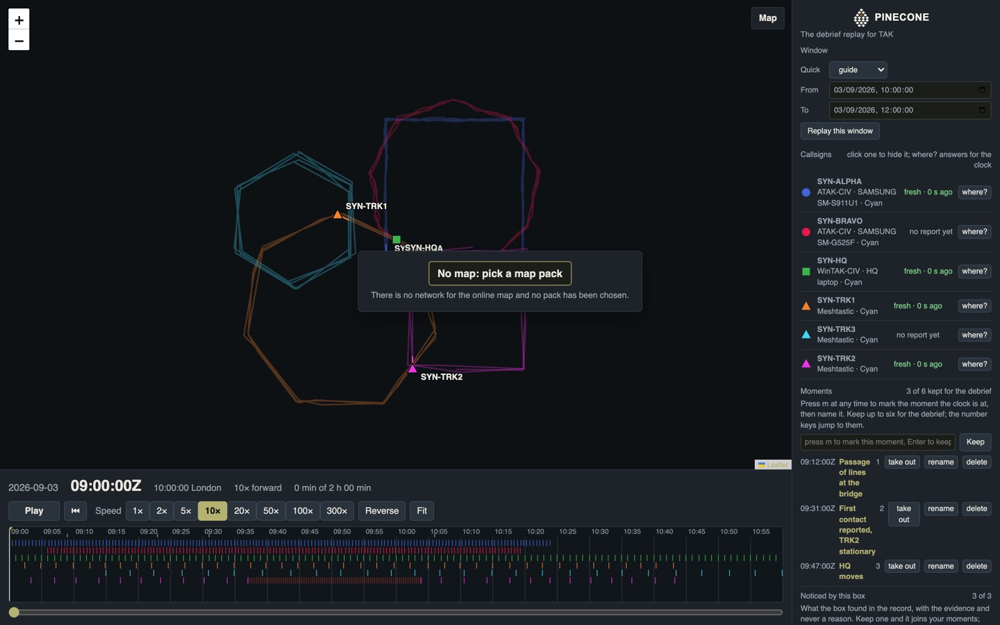

Press **Map**, top right of the map, to choose. The list has the online map first, marked with
"tiles fetched by your browser", and then every map pack the box carries, with where each came
from. Your choice is kept until you change it.

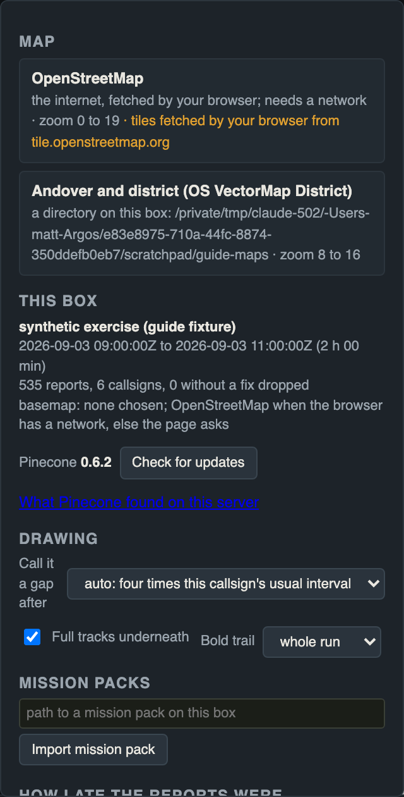

One thing to know: with the online map, the area you are looking at leaves the laptop, because
your browser asks OpenStreetMap for the tiles. When the ground is not for sharing, choose a pack.
The box itself never fetches a tile from anywhere.

## 6. Mark the moments that matter

This is the heart of a debrief. Press **m** while the replay is at the moment you want. The field
in the Moments panel asks for a name; type it and press Enter, or press Enter to keep the time as
the name.

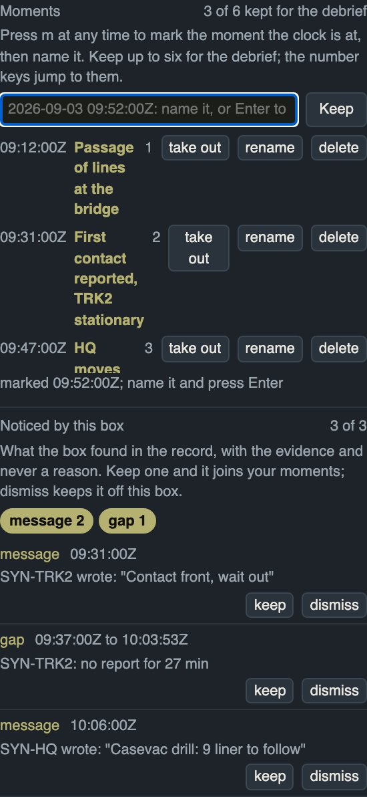

Each moment is listed and drawn on the timeline; a click jumps back to it. **Keep** up to six of
them for the debrief. Six is a budget, not a setting: people remember a handful of points from a
debrief a week later, and the six kept ones are the agenda. The number keys 1 to 6 jump to them in
order, mid-sentence, without leaving your place. A moment can be handed to somebody else as a
link, and the replay opens at it.

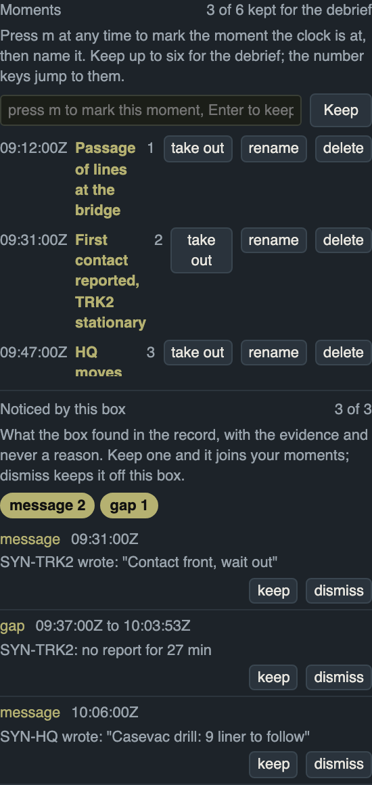

Under your moments is **Noticed by this box**: moments the box found in the record, each with its
evidence in plain words and no opinion. Two callsigns reported within fifty metres of each other
for three minutes; a callsign's gaps in reporting; a spell with no report and no message from any
callsign; a callsign reporting outside a boundary and then inside; a contact reported in the
mission pack; a message that mentions a casualty or a contact. **Keep** one and it joins your
moments in those words. **Dismiss** one and it stays off this box. The buttons above the list
filter it by kind; the box never says why any of it happened, because that is the room's to say.

## 7. What was said

The Messages panel lists the GeoChat in the window: who said it, to which room, what, and when.
The latest message shows as the replay runs, a click on one jumps there, and every message is a
tick along the top of the timeline. "I told you at half past" is settled by looking.

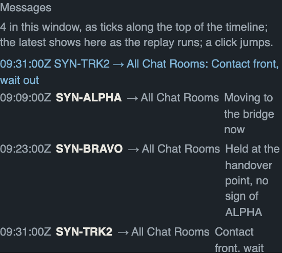

If the window holds no messages the panel says so, tells you how many the box holds in all, and
asks you to change the window to when they were sent.

## 8. The ground it happened on

A replay with no plan behind it is only movement. Behind the Map button, under **Mission packs**,
give the path of a mission pack on the box (the data package the exercise was run from) and press
**Import**. Its boundaries, phase lines, objectives and reported contacts are drawn under the
tracks, and only while each of them applied: an overlay with a window is drawn inside that window
and not outside it. Once a pack is in, **The ground it happened on** appears in the side panel
with each overlay to turn on and off.

Reported contacts are drawn as reported, never as truth. A red marker in a pack is what somebody
believed and put on the map, and the page says so.

## 9. Leave with the record

The room has agreed three things to sustain and three to improve. The Record panel turns that
into a file before anyone stands up.

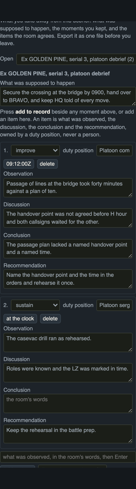

Press **Start a record for this window**, give it a title and write what was supposed to happen.
Then, beside any moment above, press **add to record**: it comes in as an observation in the
moment's own words, with the other fields empty. **Add an item** starts one from scratch. Each
item is what was observed, the discussion, the conclusion and the recommendation, marked sustain
or improve, and owned by a duty position, never a person. Fields save as you leave them.

Twelve items at most; the line under the heading keeps count and reminds you of the doctrine's
number, three and three.

**Export the record as a file** saves one Markdown file. Opened in any text editor it reads as a
take-home package: the title, what was supposed to happen, the moments you kept, and the items
in your unit's shape, ODCR by default. The box can be set to the sustain-and-improve shape
instead. The file carries a line saying where and when it was made and that it contains
callsigns. Nothing in it was written by the tool.

```markdown
# Ex GOLDEN PINE, serial 3, platoon debrief

Training record made by Pinecone 0.6.2 on the box at 2026-09-05 10:58:07Z, for the window
2026-09-03 00:20:00Z to 2026-09-03 02:20:00Z. Contains callsigns from the exercise; it is
training material and is handled as such. Nothing in it was written by the tool ...

## What was supposed to happen

Secure the crossing at the bridge by 0900, hand over to BRAVO, and keep HQ told of every move.

## Moments

- 00:32:00Z Passage of lines at the bridge
- 00:51:00Z First contact reported, TRK2 stationary
- 01:07:00Z HQ moves without telling ALPHA

## Record

### 1. Passage of lines at the bridge took forty minutes against a plan of ten.

improve; duty position: Platoon commander; at 00:32:00Z

**Discussion.** The handover point was not agreed before H hour and both callsigns waited for the other.

**Conclusion.** The passage plan lacked a named handover point and a named time.

**Recommendation.** Name the handover point and the time in the orders and rehearse it once.
```

## 10. Behind the Map button

Everything that is set once, or read by whoever set the box up, sits behind the Map button so
that the surface you drive in front of a room stays clear.

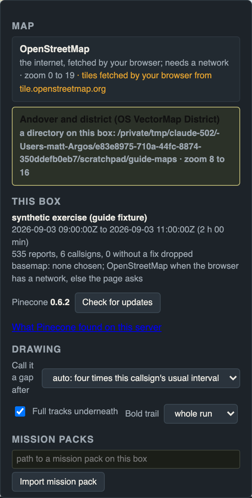

- **This box**: what is loaded and from where, the version, and the update check. Updates come
  only from tagged releases and can only be applied from the box itself.
- **Drawing**: when to call a silence a gap (four times each callsign's usual interval by
  default, or a fixed time), whether to draw the full tracks underneath, and how long a trail to
  bold.
- **Mission packs**: import, as in section 8.
- **How late the reports were**: for each callsign, how late its reports typically arrived at
  the server and how late at worst, whether its clock ran ahead, and its dropouts. The record
  holds what the server received and when; it does not hold what any handset displayed.

## 11. The status page

`/status` is the box's own report: the TAK Server it found, the database, what it holds and from
when, the retention policy, whether the recorder is running, and the one line that says whether
the page is reachable beyond the box itself.

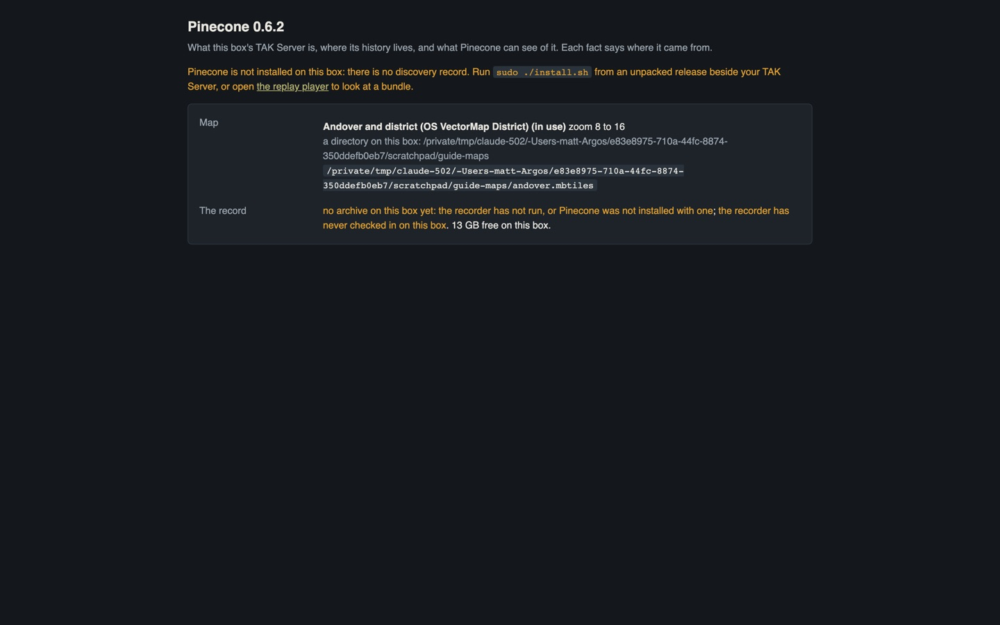

## 12. What Pinecone will never do

- **Say why.** It shows where everyone was and what was said. The reasons are the room's.
- **Grade anyone.** There is no per-person score, no league table, no per-person export.
- **Guess.** Nothing is drawn between reports; a gap is a gap.
- **Fetch anything from the internet on the box.** The online map is your browser's choice and
  the page says so.

## Keys

| Key | Does |
|---|---|
| space | play or pause |
| left, right | step ten seconds |
| [ and ] | slower, faster |
| r | reverse |
| f | fit the map to the tracks |
| m | mark the moment the clock is at |
| 1 to 6 | jump to a kept moment |
